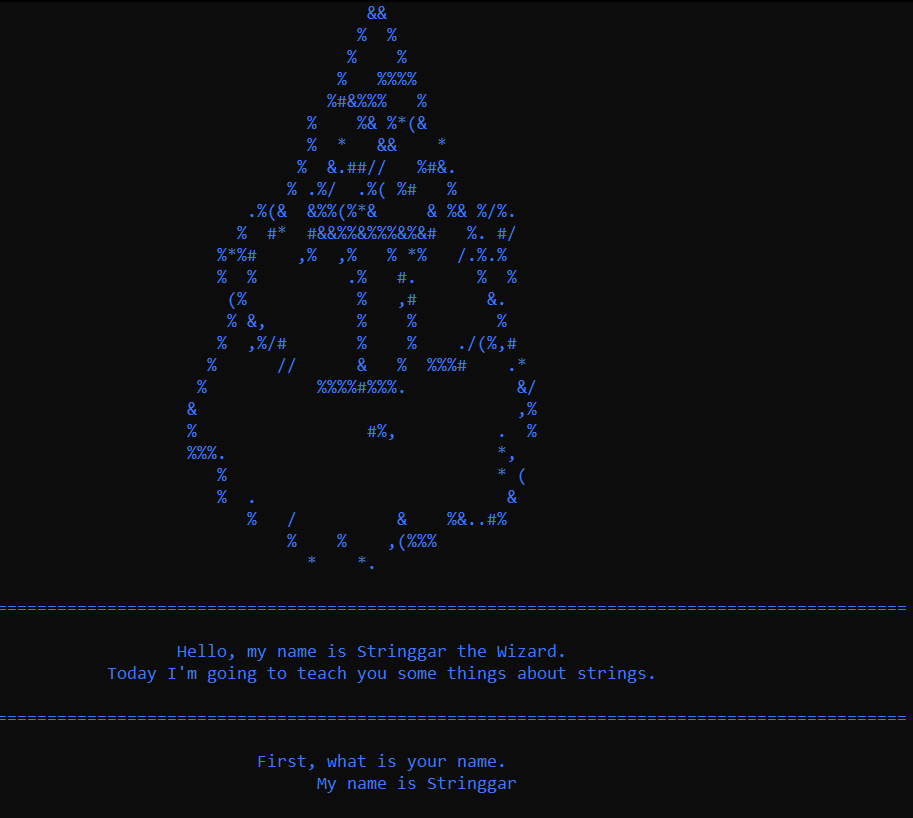
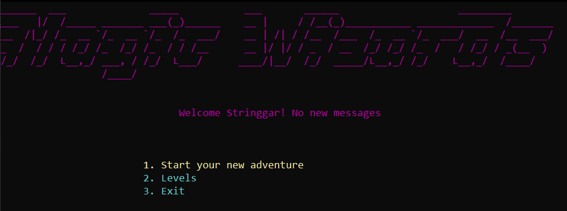
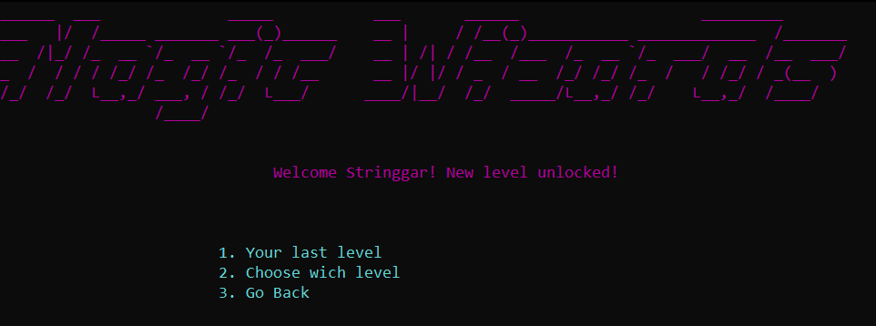
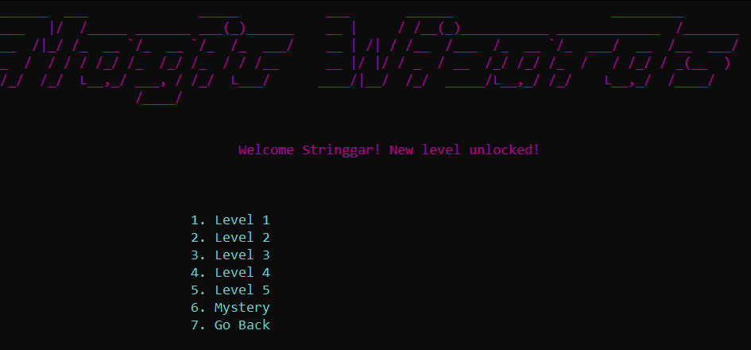
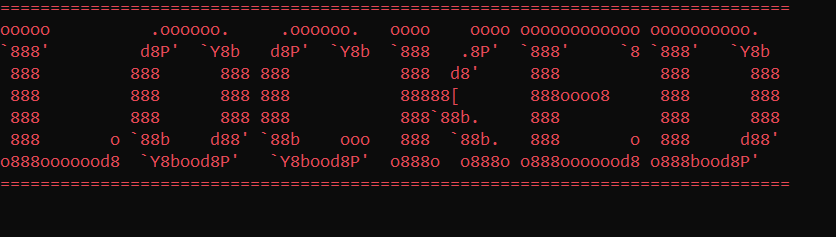

# Typhon

# Contributors

- Georgi Dryanovski <GHDryanovski19@codingburgas.bg> - Scrum Trainer

- Ivan Mihaylov <INMihaylov19@codingburgas.bg> - Back-End Developer

- Viktor Kirov <VRKirov19@codingburgas.bg> - Front-End Developer

- Maksimiliyan Dimov <MKDimov19@codingburgas.bg> - Quality Engineer

- Dimitur Dimitrov <DSDimitrov19@codingburgas.bg> - Code Check

# Resume of the Project

We are team **TYPHON**. The task is to create a game using strings. We had a month to complete the task. The only language we were able to use was C++. Our goal was to create an educational game which helps the user learn how to use strings. We got along with the goal and did a pretty good job for the given time.

* [Presentation](https://1drv.ms/p/s!BGfEvyCNrilpqk9vO_X1H98xJX99?e=82MMI9)
* [Documentation](https://codingburgas-my.sharepoint.com/:w:/g/personal/mkdimov19_codingburgas_bg/EcmURY5ZGQpGrh9PLd1KleMBGvPs64lD0F_5vWqH9eLeUQ?e=b1Q3VT)

# Pictures of final product

## •Introduction

## •Main Menu

## •Level Menu

## •Level Selector

## •This displays if you open a level and it isn't unlocked yet

# Download

- If you wish to try the game yourself you can do that by clicking the [link](https://minhaskamal.github.io/DownGit/#/home?url=https://github.com/GHDryanovski19/MagicWizard-Typhon).
